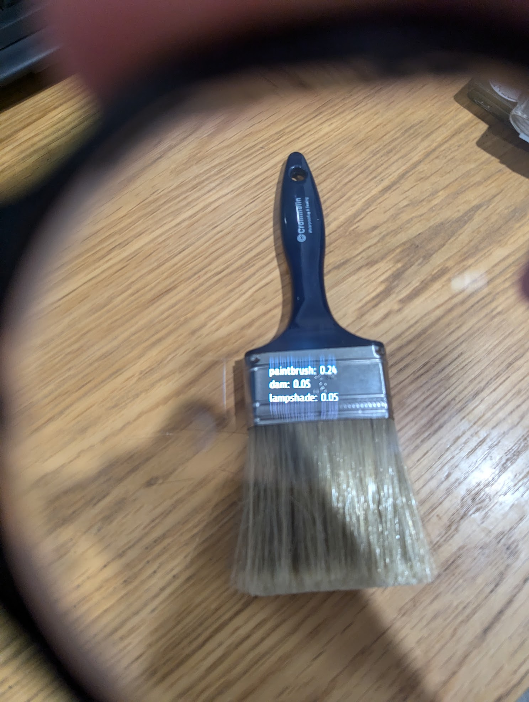
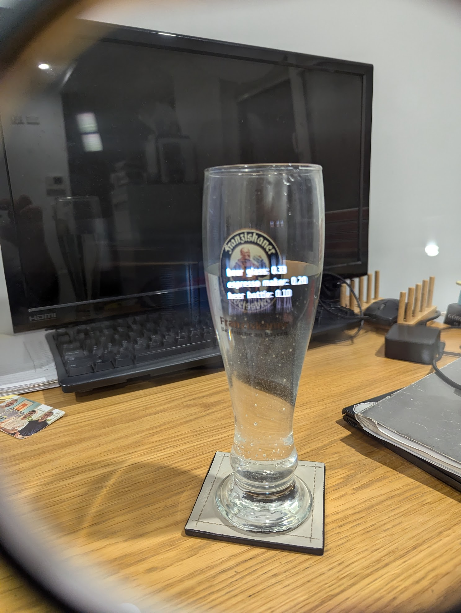
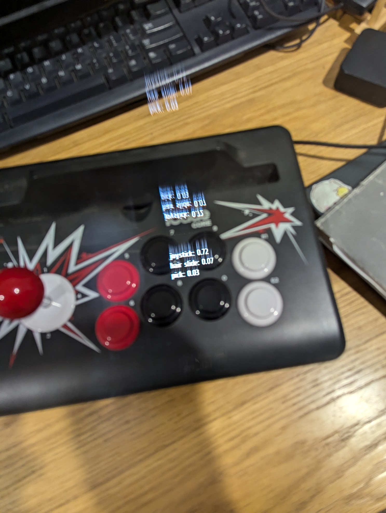
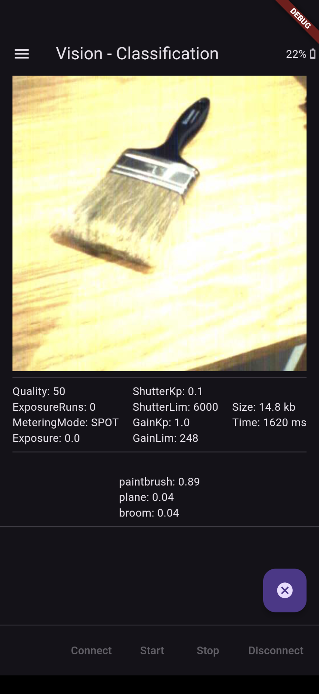
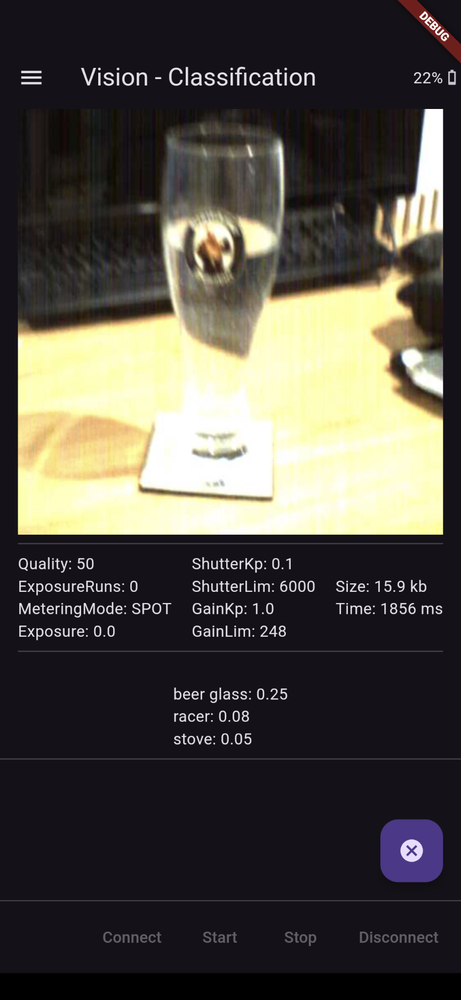
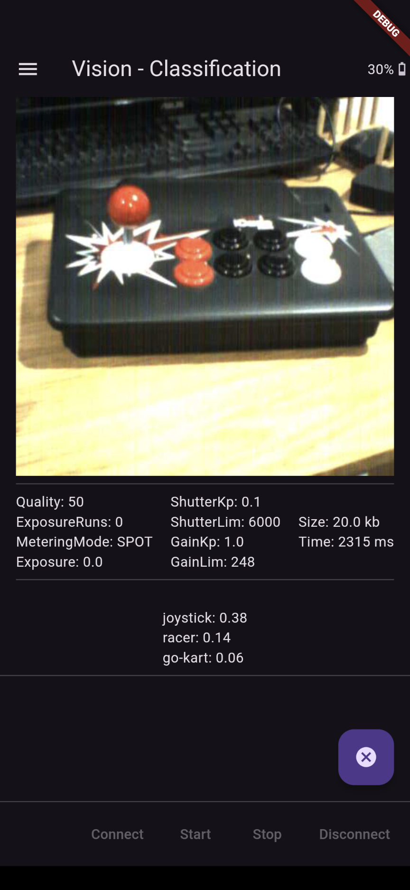

# Frame Vision - Classification

Takes repeated snapshots on Frame camera, runs image classification through a Mobilenet tensorflow-lite model on the host device and prints the highest probability classes next to the image and to the Frame display.

### Frameshots

### Screenshots

### Architecture

### See Also
- [Frame Camera](https://github.com/CitizenOneX/frame_flutter_camera)
- [Live Camera Feed](https://github.com/CitizenOneX/live_camera_feed)
